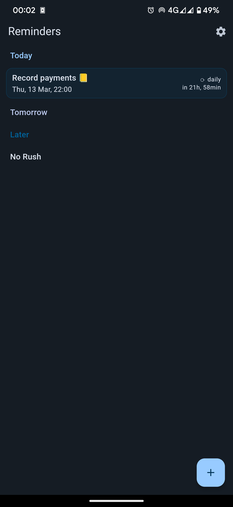
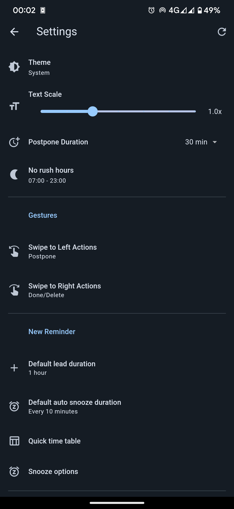
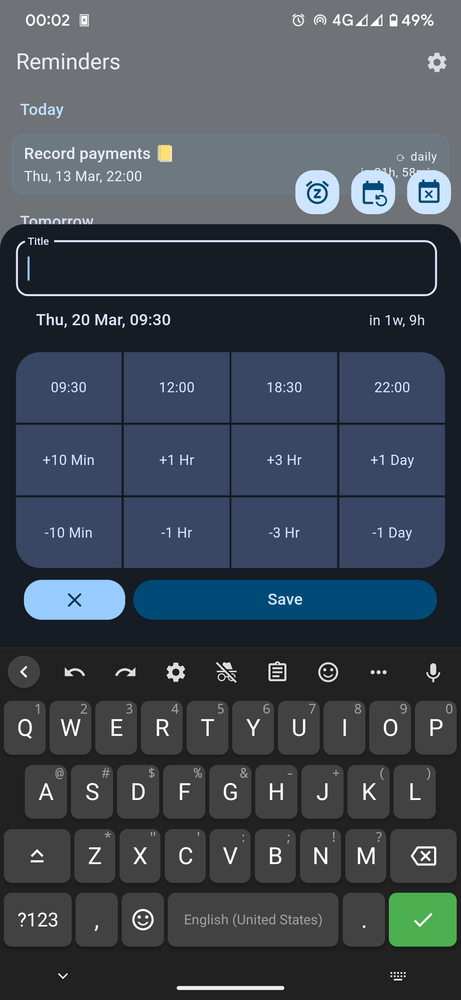

# Rem Reminds You : A Reminder Application

This is a simple reminder app built using Flutter. But it is not so simple as it reminds user repetetively until the reminder gets marked as "Done".

## Images

  

## Features

- Normal once-off reminders.
- Recurring reminders.
- Autosnooze reminders.
- No Rush reminders for when you don't have a specific time (They are assigned between next 3-14 days).
- Title Parsing. Entering "Take a nap in 15 minutes" would automatically parse title "Take a nap" while reminder time would be set as 15 minutes from the time of setting the reminder.
- Quick Access to reminders through notification.
- Editable default values in reminder sheet.
- Swipe gestures. Like, swipe to mark as done, postpone and more.
- Increment or decrement font size.
- Backup and Restore reminders.

## Features to be implemented

- Routine Reminders. Such as, "Drink Water" every 30 minutes. These wouldn't have repetitive notifications.
- Update Quick Access to Quick Edit. Instead of tapping and moving to the reminder, edit it right in the notification section.
- Drag reminders between sections in homepage.
- Different notification tones.
- More recurrence options.

## License

This project is licensed under the GNU GPL3. See the [LICENSE](LICENSE) file for details.
