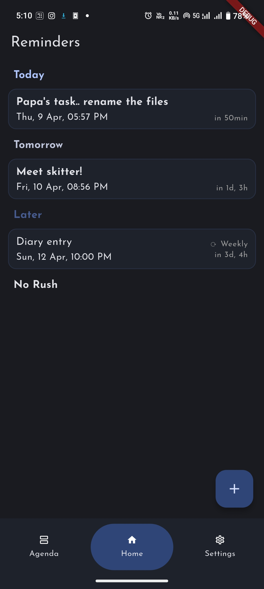
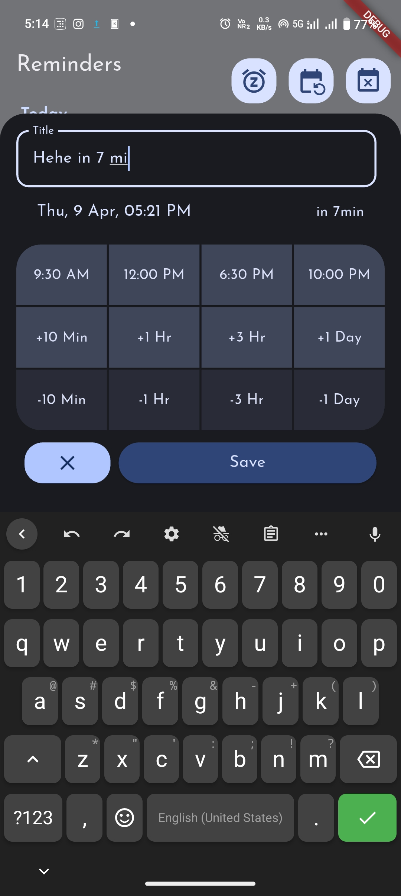
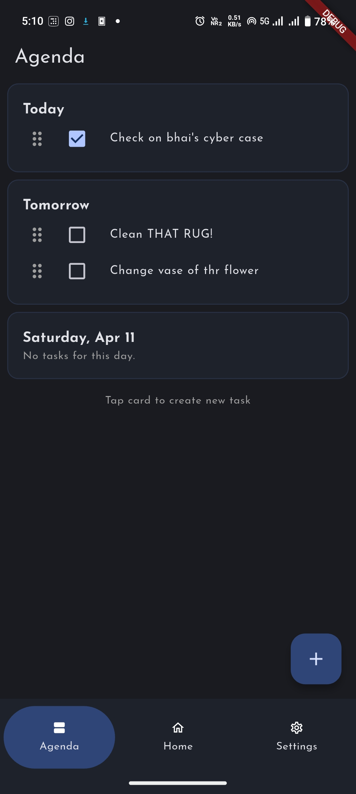
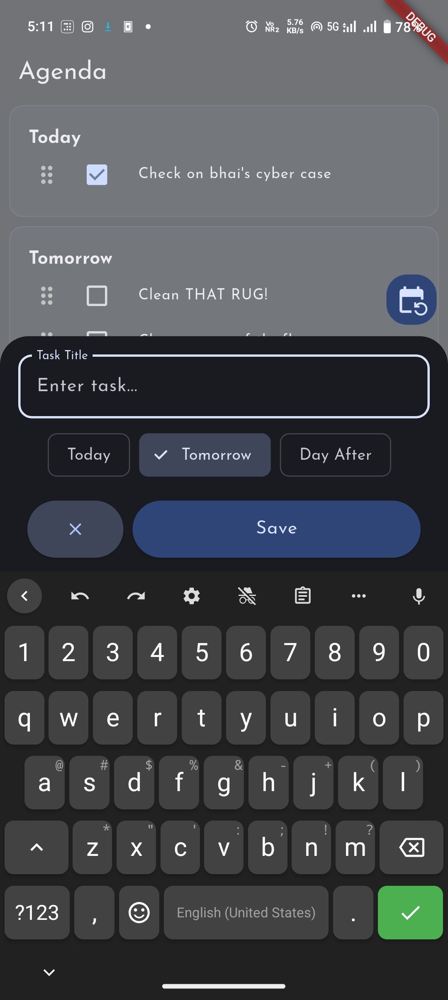

# Rem Reminds You : A Reminder Application

This is a simple reminder app built using Flutter. But it is not so simple as it reminds user repetetively until the reminder gets marked as "Done".

## Images

   

## Features

- [x] Reminders, Recurring reminders, Autosnooze reminders
- [x] Auto snooze notifications so you don't forget.
- [x] Title Parsing. Entering "Take a nap in 15 minutes" would automatically parse title "Take a nap" while reminder time would be set as 15 minutes from the time of setting the reminder.
- [x] Material Theme, Changeable in-app font size
- [x] Drag-n-Drop reminders across sections

- [x] Agenda. A notification arrives at a fixed time daily and lets you go through the added tasks, one by one. Notification is non-removable until all tasks are completed.

- [x] Support to different languages. _Only Spanish present as of now._

- [ ] Be able to change timing from notifications. Remove 'Pending' button and have the Quick-Timetable like the reminders sheet, right there in notifications.
- [ ] Different notification tones.
- [ ] More recurrence options.
- [ ] Routine Reminders. I don't see its uses other than the "Drink water" every 30 minutes, which can be performed using the autosnooze feature. So, won't be working on it. 

## Contributing

The normal flutter application building situation. Just that there are two flavors of the applications, so `flutter run` won't work properly. 

The two flavors are `prod` and `dev`. So you'd have to use `flutter run --flavor prod` and similar. Check the `.vscode/launch.json` for the configurations. Builds can be performed by adding the flavors to the usual build command `flutter build apk`.

## License

This project is licensed under the GNU GPL3. See the [LICENSE](LICENSE) file for details.
